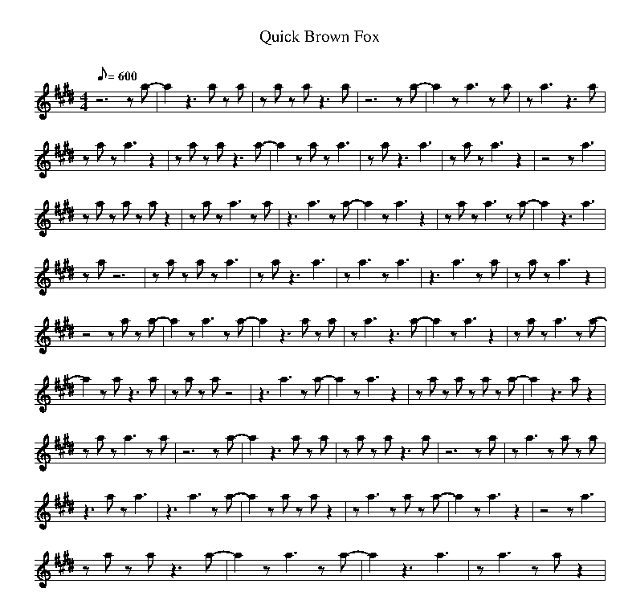

===============================================
Midimorse: Generate ABC-Notation for Morse Code
===============================================

:Author: Ralf Schlatterbeck <rsc@runtux.com>

.. |--| unicode:: U+2013   .. en dash

This is a fun project for generating morse code in `ABC music notation`_.
The `ABC tools`_ can be used for converting the resulting ``.abc`` file
into either MIDI (using ``abc2midi``) or |--| and that's the fun part |--|
morse code in musical notation. Many ABC tools are shipped with the
popular Debian Linux distribution. This project currently has no Python
installer, it's intended to be cloned with ``git`` and used in the
checkout directory.

The program supports some options, e.g., for chosing a MIDI instrument,
for setting the morse code (it is called CW (Continuous Wave) by ham
radio operators) speed or for using `Farnsworth Speed`_ (also called
Farnsworth spacing) used when training morse code.

The resulting MIDI files can be used for training (e.g. using a MIDI
player) or for other purposes like ringtones for your phone, etc.

The shipped ``Makefile`` contains examples how to create MIDI (or a
Postscript file with the musical notation) from text.

An example is the text "A quick brown fox jumps over the lazy dog" which
is a test sentence that contains all letters in the alphabet. Converted
to ABC notation this reads::

    X: 1
    T: Quick Brown Fox
    M: 4/4
    L: 1/8
    Q: 1/8=600
    K: E
    %%MIDI program 70
    z6 z a- | a2 z3 a z a | z a z a z3 a | z6 z a- | a2 z a3 z a | z a3 z3 a | 
    z a z a3 z2 | z a z a z3 a- | a2 z a z a3 | z a z3 a3 | z a z a3 z2 | z4 z a3 | 
    z a z a z a z2 | z a z a3 z a | z3 a3 z a- | a2 z a3 z2 | z a z a3 z a- | a2 z3 a3 | 
    z a z6 | z a z a z a3 | z a z3 a3 | z a3 z a3 | z3 a3 z a | z a z a3 z2 | 
    z4 z a z a- | a2 z a3 z a- | a2 z3 a z a | z a3 z3 a- | a2 z a3 z2 | z a z a3 z a- | 
    a2 z a z3 a | z a z a z4 | z3 a3 z a- | a2 z a3 z2 | z a z a z a z a- | a2 z3 a z2 | 
    z a z a3 z a | z6 z a- | a2 z3 a z a | z a z a z3 a | z6 z a | z a3 z a z a | 
    z3 a z a3 | z3 a3 z a- | a2 z a z a z2 | z a3 z a z a- | a2 z a3 z2 | z4 z a3 | 
    z a z a z3 a- | a2 z a3 z a- | a2 z3 a3 | z a3 z a z2 | 

This ABC notation can be converted to MIDI using ``abc2midi`` or to
Postscript using ``abcm2ps``. The line starting with ``%%MIDI`` defines
the instrument to use when converting to MIDI. I've chosen a flute that
has a sound not too unnatural for morse code. You can change the
instrument to use with a command-line flag to ``genmorse.py``. Since
MIDI instruments are not standardized across players you may want to
chose a different instrument |--| for better-sounding morse or for other
effects.  Rendered as music notation the ABC notation above looks like:

.. _`ABC music notation`: https://en.wikipedia.org/wiki/ABC_notation
.. _`ABC tools`: https://abcnotation.com/software
.. _`Farnsworth Speed`:
    https://en.wikipedia.org/wiki/Morse_code#Farnsworth_speed
